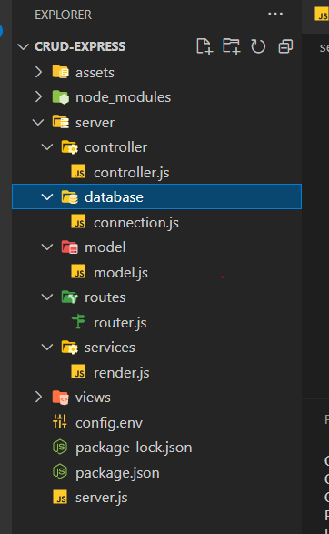

# Cách sử dụng node js để tạo một server

## Khởi tạo:

1. **yarn init**: khởi tạo file **package.json**;
2. **yarn add express**: cài đặt thư viện **express**;
3. Tạo file **index.js** cùng cấp với **package.json**;
4. Dán đoạn code này vào: **index.js**;

```js
const express = require("express");
const app = express();
const port = 3000;

app.get("/", (req, res) => {
  res.send("Hello World!");
});

app.listen(port, () => {
  console.log(`Example app listening on port ${port}`);
});
```

5. **node index.js** Chạy thử server lên;
6. **yarn add nodemon**: cài thư viện này giúp tự động restart lại app khi có sự thay đổi trong dự án
7. Thêm đoạn code này vào sửa **package.json**

```js
  "scripts": {
    "start": "nodemon index.js"
  },
```

8. **yarn start** : Chạy server thông qua thư viện **nodemon** , bây giờ khi thay đổi file bất kỳ trong dự án thì sẽ tự động refresh lại server.
9. **yarn add morgan** : Cài đặt thư viện này giúp xem được **log** những resquest được gửi lên server.

- Sau đó import vào và sử dụng:

```js
const express = require("express");
const morgan = require("morgan"); // here
const app = express();
const port = 3000;

app.use(morgan("tiny")); // here

app.get("/", (req, res) => {
  res.send("Hello Worlf!");
});

app.listen(port, () => {
  console.log(`Example app listening on port ${port}`);
});
```

## Chỉnh lại cấu trúc thư mục

1. Tạo thư mục **src**: cùng cấp với **node_modules**:
2. Chỉnh sửa lại file **package.json**

```js
  {
  "name": "backend",
  "version": "1.0.0",
  "main": "index.js", // here
  "author": "hungmanh",
  "license": "MIT",
  "scripts": {
    "start": "nodemon index.js" // here
  },
  "dependencies": {
    "express": "4.18.1",
    "morgan": "^1.10.0",
    "nodemon": "2.0.16"
  }
}
```

4. Tạo thư mục **app** trong **src** cùng cấp với thư mục**app** : trong đó sẽ chứa các thư mục sau: **controllers** ,**middleware**,..
5. Tạo thư mục: **model** trong **src** cùng cấp với thư mục**app**: trong đó sẽ chứa file **model.js** sẽ chứa các **schema**
6. Tạo thư mục: **router** trong **src** cùng cấp với thư mục**app**: trong đó sẽ chứa file **router.js**
7. Tạo thư mục: **database** trong **src** cùng cấp với thư mục**app**: trong đó sẽ chứa file **connection.js**
   

## Thay đổi router

1. Chỉnh sửa file **index.js**

```js
const express = require("express");
const morgan = require("morgan");
const app = express();
const port = 3001;

app.use(morgan("tiny"));

//load router
app.use("/", require("./src/router/router")); //here di chuyển route qua một file riêng để import vào.

app.listen(port, () => {
  console.log(`Example app listening on port ${port}`);
});
```

2. Thêm file **router.js** trong thư mục **router**

```js
const express = require("express"); //import
const router = express.Router(); //import

router.get("/api/home", (req, res) => {
  res.status(200).send({ message: "Hello word" });
});

module.exports = router;
```

## Tiến hành setup database với mongoose

1. **yarn add mongoose** : Cài đặt thư viện **mongoose** để kết nối với **clound mongose**;
2. Chỉnh sửa file **connection.js** trong thư mục **database**;

- Dán code này vào

  ```js
  const mongoose = require("mongoose");

  const connectDB = async () => {
    try {
      //chuỗi kết nối
      const con = await mongoose.connect(process.env.MONGO_URI, {
        // here chỗ này import từ env config file
        useNewUrlParser: true,
        useUnifiedTopology: true,
        //useFindAndModify: false,
        //useCreateIndex: true,
      });

      console.log("Kết nối MongoDB thành công !!!");
    } catch (err) {
      console.log(err);
      process.exit(1);
    }
  };

  module.exports = connectDB;
  ```

3. **yarn add dotenv**: cài đặt thư viện **dotenv** để config các đường dẫn và port. nâng tính bảo mật và dễ quản lý;

- Tạo file **.env** cùng cấp với **package.json** và **index.js**

```js
PORT=3001
MONGO_URI= //here uri mogodb
```

- chỉnh sửa **index.js**

```js
const express = require("express");
const morgan = require("morgan");
require("dotenv").config(); // here import dotenv
const app = express();

const port = process.env.PORT; //here collect port from .env file

app.use(morgan("tiny")); // sử dụng giúp xem được **log** những resquest được gửi lên server.

app.use("/", require("./src/router/router")); // import load router

app.listen(port, () => {
  console.log(`Example app listening on port ${port}`);
});
```

## Tiến hành xử lý file model

1. Tạo các model trong thư mục **model** ;

```js
const mongoose = require("mongoose");

let schema = new mongoose.Schema(
  {
    imagePost: {
      type: String,
      required: true,
    },
    contentPost: {
      type: String,
      required: true,
    },
    likePost: {
      type: Number,
      min: 0,
    },
    lovePost: {
      type: Number,
      min: 0,
    },
    commentsPost: {
      type: Number,
      min: 0,
    },
    statusPost: {
      type: Boolean,
      required: true,
      default: false,
    },
  },
  {
    timestamps: true,
  }
);
module.exports = mongoose.model("post", schema);
```


## Setup token 
1. `yarn add jsonwebtoken`: Create đặt thư viện

2. Tạo `ACCESS_TOKEN_SECRET` and `REFRESH_TOKEN_SECRET` trong env
3. Cấu hình token ở hàm login để trả về token
```js
const User = require("../../models/User");
const { validationResult } = require("express-validator");
const bcrypt = require("bcrypt"); // thư viện để Hash password
const JWT = require("jsonwebtoken"); // thư viện để create token

const AuthController = {

  // [POST] /api/auth/login

  async login(req, res){
    //validate
    const errors = validationResult(req);
    if (!errors.isEmpty()) {
      return res.status(400).json({ errors: errors.array() });
    }

    try {
      const { email, password } = req.body;
      const user = await User.findOne({ email: email });

      // user not found
      if (!user) {
        return res.status(400).json({ errors: [{ msg: "User do not exist" }] });
      }

      // Compare hased password with user password to see if they are valid
      const isMatch = await bcrypt.compareSync(password, user.password);

      if (!isMatch) {
        return res
          .status(401)
          .json({ errors: [{ msg: "Email or password is invalid" }] });
      }

      //Colet filed to add into token
      const {_id, firstName, lastName } = user;


      // Send JWT access token
      const accessToken = await JWT.sign(
        { id:_id, firstName, lastName },
        process.env.ACCESS_TOKEN_SECRET,
        { expiresIn: "3h" }
      );

      // Refresh token
      const refreshToken = await JWT.sign(
        { id: _id, firstName, lastName },
        process.env.REFRESH_TOKEN_SECRET,
        {
          expiresIn: "7d",
        }
      );
      // response
      return res.json({ user, accessToken, refreshToken });
    } catch (error) {
        console.error(error);
        return res
          .status(500)
          .json({ errors: [{ msg: "Internal server error" }] });
    }
  }
};

module.exports = AuthController;

```
4. Tạo thư mục `app/middleware/authentication.js ` để `verify` token khi gọi api thong qua ` Bearer Token`
```js
const JWT = require("jsonwebtoken");

const authentication = {
    
  async verifyAccessToken(req, res, next) {
    const authHeader = req.headers["authorization"];
    const token = authHeader && authHeader.split(" ")[1]; // Bearer Token

    // If token not found, send error message
    if (!token)
      return res.status(401).json({ errors: [{ msg: "Token not found" }] });
    // Authenticate token
    try {
      const user = await JWT.verify(token, process.env.ACCESS_TOKEN_SECRET);
      req.user = user;
      next();
    } catch (error) {
      console.error(error.message);
      if (error.name === "TokenExpiredError")
        return res.status(200).json({ code: 401, msg: error.message });
      return res
        .status(403)
        .json({ errors: [{ msg: "Internal server error" }] });
    }
  },

  async verifyRefreshToken(req, res, next) {
    const { refreshToken } = req.body;
    // If token not found, send error message
    if (!refreshToken)
      return res
        .status(401)
        .json({ errors: [{ msg: "Refresh token not found" }] });
    // Authenticate token
    try {
      const user = await JWT.verify(
        refreshToken,
        process.env.REFRESH_TOKEN_SECRET
      );
      req.user = user;
      next();
    } catch (error) {
      console.error(error.message);
      return res.status(403).json({ errors: [{ msg: "Invalid token" }] });
    }
  },
};

module.exports = authentication;

```
5. Sử dụng ở router
```js
const express = require('express'); //import
const router = express.Router(); //import
const validator = require("../validation/posts"); //import validator
const PostController = require("../app/controllers/PostController"); //import controller
const { verifyAccessToken } = require("../app/middleware/authentication");

//this is router
router.post("/upload",verifyAccessToken, validator.post, PostController.store);


module.exports = router;
```

6. Test lại thì dùng `Bearer Token `nha


## Deploy lên heroku.

1. Lưu ý khi public lên thì phải sửa lại `PORT` cho đúng
```js
const PORT = process.env.PORT || 3000;
app.listen(PORT, () => {
    console.log(`Our app is running on port ${ PORT }`);
});
```
2. Sửa lại đia chỉ `IP Address` thành `0.0.0.0/0` trên mongodb

## Setup cloudinary

1. **yarn add cloudinary**: Create đặt thư viện
2. **yarn add express-form-data** thư việ để passing data
3. **yarn add os** : core module of node js
4. Bỏ vào thư mục `index.js`, file server đó
<details>

  ```js
  const bodyParser = require("body-parser"); //Lấy được dữ liệu nhập vào (như trong req.body)
  const formData = require("express-form-data"); //TEST FORM DATA
  const os = require("os"); //TEST FORM DATA


  //parse request to body-parser
  app.use(bodyParser.urlencoded({ limit: "50mb", extended: true })); // Parse URL-encoded bodies using qs library
  app.use(bodyParser.json({ limit: "50mb" }));

  //TEST FORM DATA
  const options = {
    uploadDir: os.tmpdir(),
    autoClean: true,
  };

  // parse data with connect-multiparty.
  app.use(formData.parse(options));
  // delete from the request all empty files (size == 0)
  app.use(formData.format());
  // change the file objects to fs.ReadStream
  app.use(formData.stream());
  // union the body and the files
  app.use(formData.union());
  //TEST FORM DATA
  ```
  5. Tạo function upload image trong file `helper.js`
  ```js
  const cloudinary = require("../../config/cloudinary");

  const uploadImage = async (imagePath) => {
    // Use the uploaded file's name as the asset's public ID and
    // allow overwriting the asset with new versions
    const options = {
      folder: "FacbookApp", // tên folder trên cloud
      resource_type: "image", // chỉ là ảnh
      use_filename: true,
      unique_filename: false,
      overwrite: true, // cho phép đè khi cùng một ảnh
    };

    try {
      // Upload the image
      const result = await cloudinary.uploader.upload(imagePath, options);
      return result;
    } catch (error) {
      console.error(error);
    }
  };

  module.exports = { uploadImage };
  ```

</details>


6. Demo trong controller

<details>

```js
const Post = require("../../models/Post");
const { validationResult } = require("express-validator");
const { uploadImage } = require("../../shared/helper");

const PostController = {
  // [POST] /api/post
  async store(req, res) {
    //validation
    const errors = validationResult(req);
    if (!errors.isEmpty())
      return res.status(400).json({ errors: errors.array() });
    try {
      const {
        imagePost,
        contentPost,
        likePost,
        lovePost,
        commentsPost,
        statusPost,
      } = req.body;
      //gọi hàm upload image bằng cloudinary
      const urlImage = await uploadImage(imagePost?.path);

      const newPost = new Post({
        idUser: "62c39ca5adbd3436894b82e2",
        imagePost: urlImage.url,
        contentPost: contentPost,
        likePost: likePost,
        lovePost: lovePost,
        commentsPost: commentsPost,
        statusPost: statusPost,
      });
      await newPost.save();
      return res
        .status(200)
        .json({ msg: "Post was created successfully", data: newPost });
    } catch (error) {
      return res
        .status(res.error.http_code || 500)
        .json({ errors: [{ msg: error || res.error.message }] });
    }
  },
};

module.exports = PostController;

```
</details>